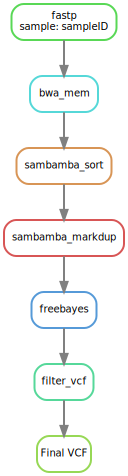

# Simple Snakemake pipeline to do Variant Calling

## Process

## Preparations

1. Genome needs to be indexed for BWA, fasta and index are located in `ref/` directory
2. Fastq files are located in `data/` directory, it expects a `*_1.fastq.gz` and `*_2.fastq.gz` files
3. AL process data is stored in `work/` directory
4. All logs are stored in `log/` directory
5. Dependencies can be added in a conda environment as defined in `environment.yaml`

## Input configuration

1. Defined in config.yaml, it requires 2 elements:
  - samples: [ sampleA, sampleB, ...]
  - genome: path/to/reference/fasta

## Execution

`snakemake <params>`
