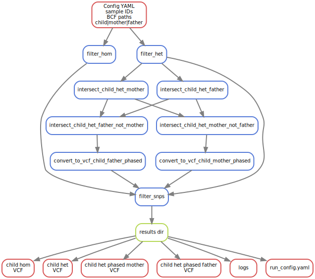

# Simple Snakemake pipeline to do Variant Calling

## Process


## Preparations

1. Genome needs to be indexed for BWA, fasta and index is defined in config file
2. Fastq files are located in a directory defined in config, it expects a `SAMPLEID1_1.fastq.gz` and `SAMPLEID1_2.fastq.gz` file names
3. All processes and results are stored by `-d` parameter in SnakeMake
4. All logs are stored under `log/` directory
5. Dependencies can be added in a conda environment as defined in `envs/environment_varcall.yaml` for running in local mode, or as modules load to be used with `--use-envmodules`
6. The pipeline can be run in a cluster (`--slurm`) if configured properly
7. Almost all jobs are requesting 10 cores, but can be scaled with `--cores N` parameter

## Input configuration

Defined in config.yaml, it requires

```
samples:
  - sampleID1
  - sampleID2
fastq_dir: /path/to/fastq/dir
genome: /path/to/genome.fa
bcf_mpileup_param: "params for bcftools mpileup"
bcf_call_param: "params for bcftools call"
bcf_norm_param: "params for bcftools norm"
bcf_filter_param: "params for bcftools filters"
```

## Execution

`snakemake <params> -d results --configfile config.yaml`

# Trio phasing of variants

## Process



## Preparations

1. Input files are BCF files from the previous workflow
2. All processes and results are stored by `-d` parameter in SnakeMake
3. All logs are stored under `log/` directory
4. Dependencies can be added in a conda environment as defined in `envs/environment_trio_filtering.yaml` for running in local mode, or as modules load to be used with `--use-envmodules`
5. The pipeline can be run in a cluster (`--slurm`) if configured properly
6. Almost all jobs are requesting 1 core, but can be scaled with `--cores N` parameter


## Input configuration

Defined in config.yaml, it requires

```
mother_id: MOM_ID
mother_bcf: /path/to/mother.bcf
father_id: DAD_ID
father_bcf: /path/to/father.bcf
child_id: KID_ID
child_bcf: /path/to/child.bcf
```

## Execution

`snakemake -s workflow/trio_filtering.smk <params> -d results --configfile config_trio.yaml`

(C) Juan Caballero 2024
